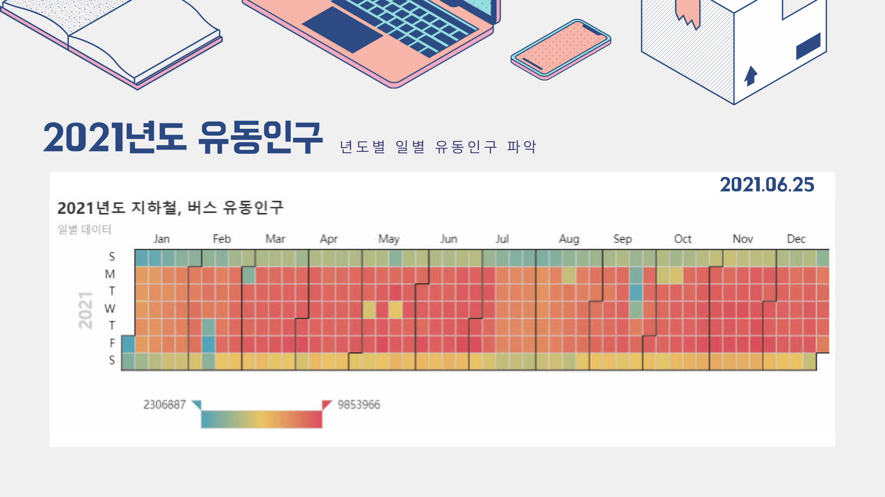

# 사고방지를 위한 인구밀집도 증가 지역 예측
## 프로젝트 소개
10.29 이태원 참사를 계기로 유동인구 및 인구 밀집도에 대한 관심을 갖게 되었고, 데이터 분석과 시각화를 통해 사고 예방과 대책 마련을 위한 자료를 만들어 보았습니다.

17년부터 21년까지 서울시의 과거 월별/일별 버스, 지하철 유동인구 데이터를 이용하여 코로나 전후의 월별 유동인구를 확인하고 특정 일자에 따라 증가하는 지역별 인구밀집도를 지도 및 그래프로 나타내 보았습니다.

이를 통해 앞으로 다가올 크리스마스 유동인구를 예측해 정부 및 지자체에 대책 마련을 촉구하고 해당 자료를 보는 사람들의 경각심을 일깨우는 효과를 기대했습니다.

### 프로젝트 기간
2022.11.15 ~ 2022.11.23.

### 참여 인원
* [@곽지섭](https://github.com/RynuRen): 데이터 전처리, 시각화, heatmap, 코드관리
* [@김해민](https://github.com/arborsday): 상담소 정리, 웹
* [@이지수](): 데이터 전처리, calender, ppt, 발표
* [@손원준](): 데이터 전처리, 이미지 처리

### 사용 기술

  
  
  
  

### 개발 환경 및 라이브러리
Windows10, python3.10, jupyter notebook, pandas, matplotlib, seaborn, pyecharts, folium, chart_studio, cufflinks, Google Sheets

## 구상

# 구현
## 데이터 전처리

## 데이터 시각화 및 분석

### pyecharts 라이브러리의 calender
* 년도별 일별 유동인구 파악
<table>
    <tr>
        <td style="border:none">
            
        </td>
        <td style="border:none">
            
        </td>
    </tr>
    <tr>
        <td style="border:none">
            
        </td>
        <td style="border:none">
            
        </td>
    </tr>
    <tr>
        <td style="border:none">
            
        </td>
        <td style="border:none">
            <a href="https://sites.google.com/view/sesacchristmas#h.348e4dde4d9f60ef_11" target="_black">GIF로 확인</a>
        </td>
    </tr>
</table>

### folium plugins의 heatmap
* 유동인구 많았던 날의 장소별 인구밀집도 변화
<table>
    <tr>
        <td style="border:none">
            
        </td>
        <td style="border:none">
            
        </td>
    </tr>
</table>

<a href="https://sites.google.com/view/sesacchristmas#h.348e4dde4d9f60ef_92" target="_black">GIF로 확인</a>

* 크리스마스 이브 인구밀집도 변화
<table>
    <tr>
        <td style="border:none">
            
        </td>
        <td style="border:none">
            <a href="https://sites.google.com/view/sesacchristmas#h.348e4dde4d9f60ef_184" target="_black">GIF로 확인</a>
        </td>
    </tr>
    <tr>
        <td style="border:none">
            
        </td>
        <td style="border:none">
            
        </td>
    </tr>
</table>

# 결론 및 한계

